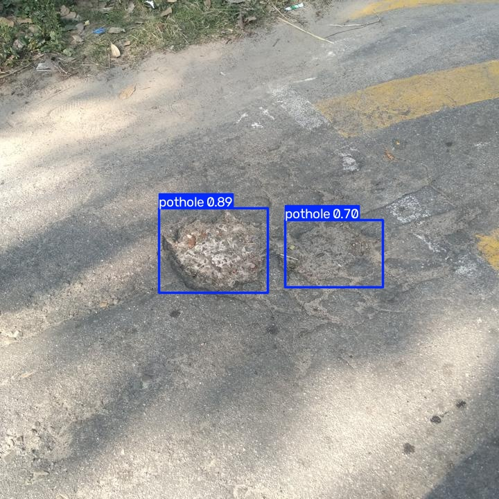

# Pothole Detection and Severity Analysis Using Computer Vision

## 1. Project Overview

This project develops a computer vision system for detecting potholes in road images using a YOLO-based object detection model.

The system detects potholes, counts the detected potholes, estimates their severity based on their relative image area, and evaluates the trained model using standard object detection metrics.

## 2. Features

- Pothole dataset preparation
- Training, validation, and testing dataset split
- Image preprocessing
- YOLO-based pothole detection
- Pothole counting
- Image-based severity estimation
- Model evaluation
- Automated project validation
- Command-line execution
- Annotated output generation
- Automated pothole detection report generation

## 3. Technologies Used

- Python 3.11
- Ultralytics YOLO
- PyTorch
- OpenCV
- Git and GitHub

## 4. Project Structure

```text
Pothole-Detection-Computer-Vision/
│
├── data.yaml
├── requirements.txt
├── statement.md
├── README.md
├── .gitignore
├── yolo11n.pt
│
├── data/
│   ├── images/
│   ├── labels/
│   └── raw/
│
├── results/
│
└── src/
    ├── prepare_dataset.py
    ├── preprocess.py
    ├── train.py
    ├── detect.py
    ├── evaluate.py
    ├── severity.py
    ├── report.py
    └── test_project.py
```

## 5. Installation

### Step 1: Clone the repository

```bash
git clone https://github.com/Akankshya-35-45/Pothole-Detection-Computer-Vision.git
cd Pothole-Detection-Computer-Vision
```

### Step 2: Create a virtual environment

```bash
python -m venv venv
```

### Step 3: Activate the virtual environment

Windows PowerShell:

```powershell
.\venv\Scripts\activate
```

### Step 4: Install dependencies

```bash
pip install -r requirements.txt
```

## 6. Dataset Preparation

The dataset is organized into training, validation, and testing sets.

Run:

```bash
python src/prepare_dataset.py
```

Dataset split used in this project:

- Training: 870 images
- Validation: 248 images
- Testing: 125 images
> Note: The dataset is not included in the GitHub repository because of its size. The `data/` directory is created locally during dataset preparation.

## 7. Model Training

The YOLO model is trained using:

```bash
python src/train.py
```

The trained model weights are saved as:

```text
results/pothole_model-2/weights/best.pt
```

## 8. Pothole Detection

The detection module can be executed using:

```bash
python src/detect.py --model "results\pothole_model-2\weights\best.pt" --input "data\images\test\img-101.jpg" --output "results\final_img-101.jpg" --report "results\pothole_report.txt"
```

The system generates:

- Annotated detection image
- Pothole count
- Confidence scores
- Severity estimates
- Text-based detection report

## 9. Model Evaluation

The model can be evaluated using:

```bash
python src/evaluate.py
```

The evaluation includes:

- Precision
- Recall
- mAP@50
- mAP@50-95

## 10. Model Performance

The following results were obtained by evaluating the trained model on the test dataset containing 125 images.

| Metric | Score |
|---|---:|
| Precision | 71.87% |
| Recall | 57.80% |
| mAP@50 | 66.13% |
| mAP@50-95 | 35.01% |

### Evaluation Methodology

The trained YOLO model was evaluated on the test split using standard object detection metrics:

- **Precision:** Measures the proportion of predicted potholes that were correct.
- **Recall:** Measures the proportion of actual potholes detected by the model.
- **mAP@50:** Mean Average Precision at an IoU threshold of 0.50.
- **mAP@50-95:** Mean Average Precision averaged across IoU thresholds from 0.50 to 0.95.

## 11. Detection Example

For the tested image `img-101.jpg`, the model detected two potholes.

| Detection | Confidence | Severity | Area |
|---|---:|---|---:|
| Pothole 1 | 0.89 | Moderate | 3.70% |
| Pothole 2 | 0.70 | Moderate | 2.66% |

The detection output contains bounding boxes around the detected potholes along with their confidence scores.

### Detection Output



*Figure 1: YOLO-based pothole detection output showing the detected potholes and confidence scores.*

## 12. Severity Analysis

The system provides three severity levels:

- Low
- Moderate
- High

Severity is estimated using the relative area occupied by the detected pothole in the image.

The severity estimation is intended as an image-based approximation.

## 13. Project Validation

The project includes an automated validation script:

```bash
python src/test_project.py
```

The validation checks the project setup, dataset organization, and availability of the trained model.

## 14. Output

Example output files generated by the system include:

```text
results/
├── detected_img-101.jpg
├── final_img-101.jpg
├── preprocessed_img-101.jpg
└── pothole_report.txt
```

The annotated output image contains bounding boxes around detected potholes with confidence scores.

The pothole report contains the detected pothole count, confidence values, severity levels, and estimated area information.

## 15. Limitations

The severity classification is an image-based estimate using the relative detected pothole area.

It does not directly measure:

- Physical pothole depth
- Road structural damage
- Road safety condition

Therefore, the severity output should be considered an approximate visual assessment rather than an engineering measurement.

## 16. Future Enhancements

- Improve detection accuracy using a larger and more diverse dataset
- Add real-time pothole detection using video or camera input
- Improve severity estimation using depth information
- Develop a web-based interface
- Add GPS-based pothole location mapping
- Deploy the model on edge or mobile devices
